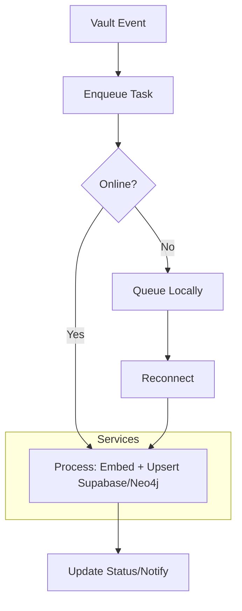

# ARCHITECTURE.md: Architectural Overview of Obsidian-RAG

This document outlines the high-level architecture of Obsidian-RAG, emphasizing its modular design, data flows, and extensibility points. Built as a TypeScript-based Obsidian plugin, it focuses on ingestion-only synchronization to Supabase (vector store) and Neo4j (graph database) for Hybrid RAG systems. For development setup, refer to [DEVELOPMENT.md](DEVELOPMENT.md).

## Design Principles
- **Privacy-First**: Defaults to Ollama for local embeddings; OpenAI as optional fallback. No data leaves the user's control.
- **Resilience**: Offline queuing with automatic reconciliation; retry mechanisms for failures.
- **Modularity**: Service-based architecture for easy testing and extension.
- **Isolation**: `project_name` scopes all DB operations to prevent vault mixing.
- **Ingestion-Only**: No querying within the plugin—prepare data for external tools like n8n or bots.
- **Event-Driven**: Uses an internal EventEmitter for loose coupling between components.

## High-Level Components
Obsidian-RAG is structured around the Obsidian Plugin API, with layers for settings, services, utils, and models.

### Directory Structure Recap
```
Obsidian-RAG/
├── main.ts                       # Plugin entry and lifecycle
├── settings/                     # Config UI and interfaces
├── services/                     # Core logic (DB, queue, sync)
├── utils/                        # Helpers (chunking, errors)
├── models/                       # Type definitions
├── scripts/                      # Dev utilities
├── sql/                          # DB schemas
├── tests/                        # Integration tests
└── manifest.json                 # Plugin metadata
```

### Key Layers
1. **Plugin Entry (main.ts)**:
   - Handles lifecycle: `onload` initializes services, registers events (e.g., vault changes via `this.app.vault.on`), and sets up commands.
   - `onunload`: Cleans up listeners and queues.
   - Exposes command palette actions (e.g., force sync, clear queue).

2. **Settings Layer**:
   - **Settings.ts**: Defines `ObsidianRAGSettings` interface with defaults (e.g., API keys, exclusions, modes).
   - **SettingsTab.ts**: Renders UI with tabs for Supabase/Neo4j config, connection tests, resets, and previews. Includes status indicators and donation QR.

3. **Services Layer** (Core Business Logic):
   - **EmbeddingService.ts**: Generates embeddings via Ollama (default) or OpenAI. Supports retries and fallbacks.
   - **SupabaseService.ts**: Manages vector store ops—upsert chunks, delete records, initialize tables/indexes via SQL scripts.
   - **Neo4jService.ts** (implied/integrated): Upserts nodes (notes, entities) and relationships (tags, links) for GraphRAG.
   - **QueueService.ts**: Async task queue for processing (e.g., Bull.js-inspired, but custom). Handles parallelism and events.
   - **OfflineQueueManager.ts**: Persists tasks locally (e.g., via Obsidian's data.json); reconciles on reconnect.
   - **InitialSyncManager.ts**: Batch processes entire vault on first run or manual trigger.
   - **SyncDetectionManager.ts**: Detects quiet periods for background syncs.
   - **StatusManager.ts**: Tracks progress, emits events for UI updates.
   - **SyncFileManager.ts**: Coordinates cross-device sync via a shared metadata file.
   - **MetadataExtractor.ts**: Pulls YAML frontmatter, tags, and entities from notes.
   - **EventEmitter.ts**: Central pub/sub for inter-service communication (e.g., `queue:processed` triggers status update).

4. **Utils Layer**:
   - **TextSplitter.ts**: Chunks notes with overlap, handles YAML extraction and preprocessing.
   - **ErrorHandler.ts**: Centralized logging, retries, and notifications.
   - **FileTracker.ts**: Hashes metadata for change detection.
   - **NotificationManager.ts**: In-app toasts, progress bars, and overlays (e.g., sync graph).

5. **Models Layer**:
   - TypeScript interfaces for consistency: `DocumentChunk.ts` (chunk metadata with file_id, lines), `ProcessingTask.ts` (queue items), `SyncModels.ts` (DB schemas).

## Data Flow
### Sync Process (Hybrid Mode Example)
1. **Trigger**: Vault event (create/update/delete) or command → `SyncManager` enqueues `ProcessingTask`.
2. **Queue Processing**:
   - Extract metadata (`MetadataExtractor`).
   - Split text into chunks (`TextSplitter`).
   - Generate embeddings (`EmbeddingService`).
   - Upsert to Supabase (`SupabaseService`): Insert into `documents` table with `project_name` scope.
   - Extract/build entities → Upsert to Neo4j: Create nodes/relationships.
3. **Offline Handling**: If disconnected, persist to local queue; resume via `OfflineQueueManager` on reconnect.
4. **Error/Retry**: `ErrorHandler` logs and retries (exponential backoff).
5. **Status**: `StatusManager` updates UI; notifications on completion/failure.

Mermaid Diagram for Sync Flow:


### Extensibility Points
- **Custom Embeddings**: Extend `EmbeddingService` for new providers.
- **Entity Extraction**: Override `MetadataExtractor` for advanced NLP (e.g., integrate spaCy via worker).
- **Modes**: Add custom hybrid strategies in settings (e.g., graph-first).
- **Integrations**: Hook into events for plugins like n8n—e.g., emit webhooks on sync complete.
- **Testing Mocks**: Services are injectable; mock DB clients for isolated tests.

## Performance Considerations
- **Batching**: Initial sync uses batches to avoid overwhelming DBs.
- **Indexing**: Auto-creates Supabase vector indexes and Neo4j constraints.
- **Scalability**: Queue limits parallelism; monitor for large vaults.
